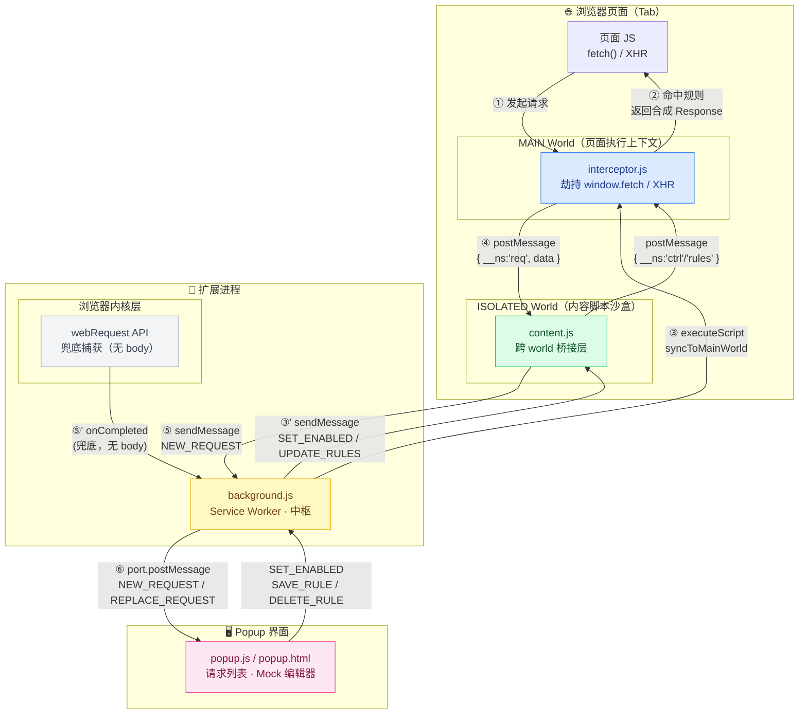

# Timmy Network Sync — 研发提效插件

## 架构 & 数据链路

### 整体链路图



---

### 各文件职责

| 文件 | 运行环境 | 职责 |
|---|---|---|
| **interceptor.js** | MAIN World（页面级） | 劫持 `window.fetch` 和 `XMLHttpRequest`；命中 Mock 规则时返回合成响应；捕获请求/响应数据并通过 `postMessage` 上报 |
| **content.js** | ISOLATED World（内容脚本） | 跨 world 桥接：把 background 的控制指令（开关、规则）转发给 interceptor；把 interceptor 捕获的请求转发给 background |
| **background.js** | Service Worker（扩展进程） | 全局中枢：管理 Tab 状态、Mock 规则持久化、popup 长连接、webRequest 兜底捕获、双路去重 |
| **popup.js/html/css** | Extension Page（popup 窗口） | 展示请求列表、Mock 规则编辑器；与 background 保持长连接端口通信 |
| **manifest.json** | 浏览器读取 | 声明权限、content script 注入策略、Service Worker 入口 |

---

### 关键设计决策

| 决策 | 原因 |
|---|---|
| 双路注入 interceptor（manifest + executeScript） | manifest 注入可能因 CSP/时序失败，executeScript 在 popup 打开时补注 |
| webRequest + interceptor 双路捕获 + 去重 | webRequest 可靠但无 body；interceptor 有 body 但依赖注入成功；两路互补 |
| `window.postMessage` 替代 CustomEvent | CustomEvent 在 ISOLATED↔MAIN 跨 world 时 `e.source !== window` 检查不可靠 |
| `chrome.scripting.executeScript` 直推 MAIN world | 绕过 content script，在其失效（扩展重载）时仍能更新 interceptor 的状态 |
| port name 编码 tabId（`popup-123`） | 独立窗口模式下无法用 `currentWindow` 查 tab，改为连接时同步传递，零异步依赖 |
| `chrome.storage.session` 持久化 Tab 状态 | SW 随时可能被 Chrome 终止，session storage 在浏览器会话内跨重启保持 |

---

## 背景与问题

前端开发中，**接口联调是效率黑洞**。典型痛点：

| 痛点 | 表现 |
|---|---|
| 后端接口未就绪 | 前端等待，流程阻塞，无法并行开发 |
| 接口数据结构变更 | 手动修改调试数据，改完再改 |
| 边界/异常场景构造难 | 要后端配合造数据，沟通成本高 |
| 线上问题复现难 | 无法看到实际请求/响应，只能猜 |
| 接口联调反复刷页 | 改一点，等真实请求，效率低 |

---

## 插件做了什么

一款 Chrome/Edge 浏览器插件，覆盖从**捕获 → 筛选 → Mock → 导出**的完整链路。

```
真实页面
  ↓
[捕获] 实时抓取所有 XHR/Fetch 请求（URL、Method、Headers、Body、响应）
  ↓
[筛选] 按 URL 关键字 / Method 快速定位目标接口
  ↓
[Mock] 一键基于真实响应建立拦截规则，返回自定义数据
  ↓
[导出] 规则 JSON 导出，团队共享/版本化管理
```

---

## 核心功能与提效场景

### 1. 实时网络请求捕获

**解决什么问题：** 不用打开 DevTools Network 面板，不用找请求，在独立窗口实时看所有接口。

**提效点：**
- 开发时保持编辑器全屏，请求面板独立浮窗 → 减少切换成本
- 请求/响应 body、headers 一屏可见，不用逐层展开 DevTools

---

### 2. 场景化 Mock 拦截器

**解决什么问题：** 前端不依赖后端就能开发和测试。

**典型场景：**

| 场景 | 传统方式 | 使用插件 |
|---|---|---|
| 后端接口未就绪 | 等待 or 本地硬编码 mock 数据 | 插件直接拦截，返回自定义数据，0等待 |
| 测试接口异常/错误码 | 让后端改配置 or 改代码 | 插件设置状态码 500/401，秒切换 |
| 测试空数据 / 边界值 | 手动构造测试账号 | Mock body 直接改，立刻生效 |
| 测试不同数据结构 | 等后端改接口 | 本地修改 Mock body，无需后端介入 |
| 快速验证 UI 状态 | 后端接口+数据 ready 才能看 | 自定义任意数据，UI 立刻反应 |

**关键设计：**
- **一键 Mock It**：从捕获到的真实请求直接建规则，body 自动预填，3秒内完成
- **不影响其他请求**：只拦截匹配的接口，其他请求正常走真实网络
- **支持 URL 模糊/精确/正则匹配**，适应各种接口命名风格
- **支持延迟设置**：模拟慢网络，测试 loading 状态

---

### 3. 规则导出 / 团队共享

**解决什么问题：** Mock 规则不只属于一个人，复杂场景需要复用。

```
开发者 A 建好一套 Mock 规则 → 导出 JSON → 提交 Git or 发给 B
开发者 B 导入 → 秒级还原相同 Mock 环境
```

**提效点：**
- 新人入职：导入标准 Mock 包，本地开发环境 5 分钟就绪
- 复杂业务场景沉淀为可复用规则集，减少重复造轮子

---

## 提效量化

### 假设场景

一个前端团队，5 人，每天联调时间占比 30%。

| 指标 | 传统方式 | 使用插件 | 节省 |
|---|---|---|---|
| 构造一个 Mock 场景 | 15 分钟（改代码 or 沟通后端） | 1 分钟（一键 Mock It） | **14 分钟/次** |
| 复现一个线上 Bug | 30 分钟（猜+反复刷） | 5 分钟（捕获真实请求+Mock复现） | **25 分钟/次** |
| 新人搭建本地 Mock 环境 | 2-4 小时 | 5 分钟（导入规则） | **~3 小时/人** |
| 前后端并行开发阻塞次数 | 3-5 次/天 | 0（Mock 替代真实接口） | **3-5 次/天** |

### 保守估算（单人/天）

```
Mock 场景构造  ×5 次  → 节省 70 分钟
Bug 复现调试  ×1 次  → 节省 25 分钟
等待接口阻塞  ×2 次  → 节省 30 分钟
────────────────────────────
合计            → 节省 ~125 分钟/人/天
```

**5 人团队 × 125 分钟 = 每天节省 ~10 人时 = 1.25 个工作日**

---

## 与现有工具对比

| 工具 | 优点 | 缺点 |
|---|---|---|
| DevTools Network | 内置，0 成本 | 无 Mock，关闭即失，操作繁琐 |
| Charles/Whistle | 功能强大 | 需要配置代理，HTTPS 需信任证书，学习成本高 |
| Mock.js | 代码层面 Mock | 需要改项目代码，不适合生产环境调试 |
| Postman Mock Server | 强大的接口管理 | 与浏览器割裂，无法实时抓包 |
| **本插件** | 零配置，浏览器内，实时捕获+Mock一体 | 暂不支持 response body 全量捕获（MV3 限制） |

---

## 适合哪些场景

✅ 前后端并行开发，接口未就绪时前端自测  
✅ 测试各种 API 返回状态（200/401/500/空数据/异常结构）  
✅ 快速复现线上问题（捕获真实请求 → Mock 注入异常数据）  
✅ 演示/Demo 场景，需要固定数据不依赖真实环境  
✅ 团队统一 Mock 规则，保证开发环境一致性  

❌ 不适合：需要持久化 Mock 服务、团队规模极大需要集中管理接口文档的场景（建议配合 Apifox/Swagger）
